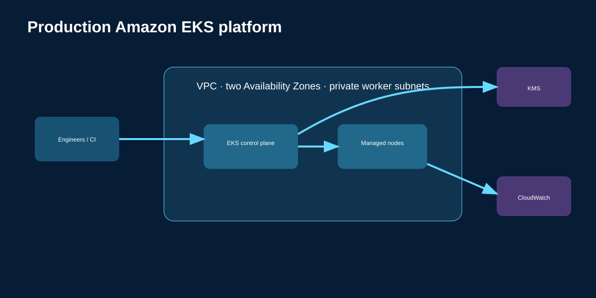

# Production-ready Amazon EKS Platform

End-to-end Terraform infrastructure and Kubernetes deployment project for a
production-style EKS environment.



## What problem it solves

It provides a repeatable secure baseline for teams running containerized APIs:
private worker networking, separate NAT gateways by AZ, encrypted Kubernetes
Secrets, managed node scaling, audit logs, and opinionated workload controls.

## Repository layout

```text
terraform/environments/production/  # deployable production composition
terraform/modules/network/          # VPC, public/private subnets, HA NAT
terraform/modules/eks/              # KMS, EKS control plane, managed nodes
terraform/modules/addons/           # core EKS add-ons
kubernetes/production-demo/         # Deployment, Service, HPA, PDB
diagrams/                           # architecture graphic
```

## AWS deployment

```bash
cd terraform/environments/production
cp terraform.tfvars.example terraform.tfvars
terraform init
terraform validate
terraform plan
terraform apply
aws eks update-kubeconfig --region us-east-1 --name eks-platform-production
kubectl apply -f ../../../kubernetes/production-demo
```

The cluster endpoint is private-only. Run `kubectl` from a connected network
(VPN, Direct Connect, bastion, or a CI runner inside the VPC).

## Local Floci plan

```bash
cd terraform/environments/production
terraform init -backend=false
terraform validate
terraform plan -var=use_floci=true
```

`use_floci` is opt-in; AWS is the default target. The local plan validates the
Terraform graph. An AWS apply creates billable NAT gateways and EKS capacity.

## Production follow-ups

Add remote state with locking, IAM Identity Center or EKS access entries,
VPC endpoints, a load balancer controller, external DNS, secrets rotation,
policy enforcement, backups, and a CI/CD role before handling sensitive traffic.
