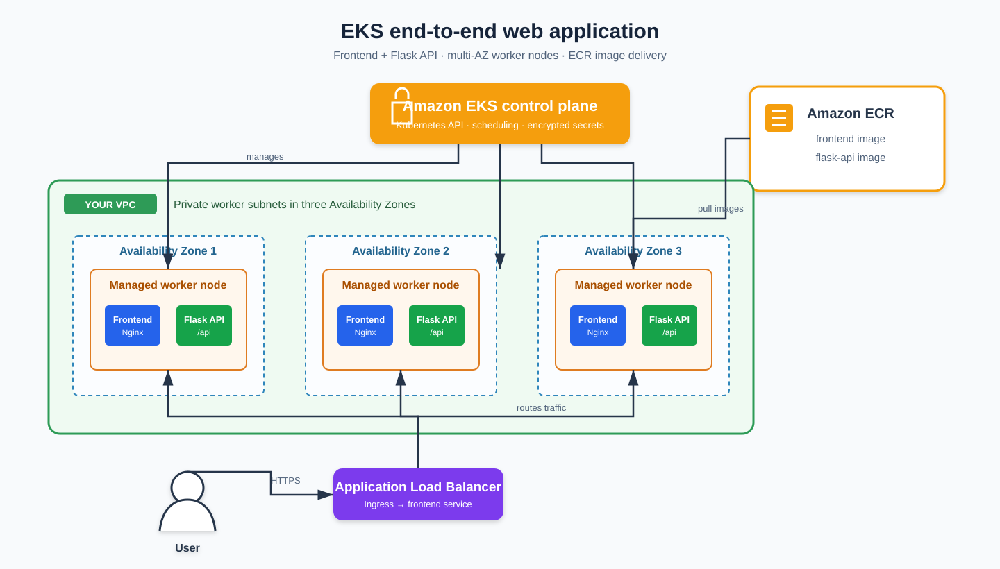

# Production-ready Amazon EKS Platform

End-to-end Terraform infrastructure and Kubernetes deployment project for a
production-style EKS environment.



## What problem it solves

It provides a repeatable secure baseline for teams running a browser frontend
and a containerized API: private worker networking, separate NAT gateways by
AZ, encrypted Kubernetes Secrets, managed node scaling, audit logs, and
opinionated workload controls.

## Repository layout

```text
terraform/environments/production/  # deployable production composition
terraform/modules/network/          # VPC, public/private subnets, HA NAT
terraform/modules/eks/              # KMS, EKS control plane, managed nodes
terraform/modules/addons/           # core EKS add-ons
kubernetes/web-app/                 # Frontend, Flask API, Ingress, HPA, PDB
applications/frontend/              # Browser application and Nginx container
applications/flask-api/             # Runnable Flask REST API container
diagrams/                           # architecture graphic
```

## Architecture layers

1. **User and traffic layer** — The user reaches an internet-facing Application
   Load Balancer created by the AWS Load Balancer Controller from the Ingress.
2. **EKS control plane** — AWS operates the Kubernetes API and encrypts
   Kubernetes Secrets with KMS. It decides where desired pods should run.
3. **Worker layer** — Managed node groups span three Availability Zones. Public
   subnets host the ALB and HA NAT gateways; private subnets host the frontend
   and Flask API pods. A single node/AZ loss does not take the application down.
4. **Application layer** — Nginx serves the frontend and proxies `/api` calls
   to the internal Flask Service. The API exposes `/healthz` and `/api/message`.
5. **Registry and delivery layer** — CI builds the two Docker images and pushes
   immutable tags to ECR. Kubernetes pulls those tags into the worker nodes.
6. **Reliability and operations layer** — HPA scales Flask pods, the PDB keeps
   two available during voluntary disruption, and CloudWatch receives cluster
   control-plane logs.

The Terraform layer deliberately creates the networking, EKS, KMS, ECR, IAM,
and core EKS add-ons. Install the AWS Load Balancer Controller once per cluster
before applying the Ingress; it turns the Kubernetes Ingress into the public
ALB shown in the diagram.

## AWS deployment

```bash
cd terraform/environments/production
cp terraform.tfvars.example terraform.tfvars
terraform init
terraform validate
terraform plan
terraform apply
aws eks update-kubeconfig --region us-east-1 --name eks-platform-production
```

### Build, publish, and deploy the actual application

```bash
export ACCOUNT_ID=$(aws sts get-caller-identity --query Account --output text)
export REGION=us-east-1
export PREFIX=eks-platform-production

aws ecr get-login-password --region "$REGION" | \
  docker login --username AWS --password-stdin "$ACCOUNT_ID.dkr.ecr.$REGION.amazonaws.com"

docker build -t "$PREFIX/frontend:1.0.0" ../../../applications/frontend
docker build -t "$PREFIX/flask-api:1.0.0" ../../../applications/flask-api
docker tag "$PREFIX/frontend:1.0.0" "$ACCOUNT_ID.dkr.ecr.$REGION.amazonaws.com/$PREFIX/frontend:1.0.0"
docker tag "$PREFIX/flask-api:1.0.0" "$ACCOUNT_ID.dkr.ecr.$REGION.amazonaws.com/$PREFIX/flask-api:1.0.0"
docker push "$ACCOUNT_ID.dkr.ecr.$REGION.amazonaws.com/$PREFIX/frontend:1.0.0"
docker push "$ACCOUNT_ID.dkr.ecr.$REGION.amazonaws.com/$PREFIX/flask-api:1.0.0"

kubectl apply -f ../../../kubernetes/web-app/
kubectl -n web-app set image deployment/frontend \
  frontend="$ACCOUNT_ID.dkr.ecr.$REGION.amazonaws.com/$PREFIX/frontend:1.0.0"
kubectl -n web-app set image deployment/flask-api \
  flask-api="$ACCOUNT_ID.dkr.ecr.$REGION.amazonaws.com/$PREFIX/flask-api:1.0.0"
kubectl -n web-app rollout status deployment/frontend
kubectl -n web-app rollout status deployment/flask-api
kubectl get ingress -n web-app
```

The `ADDRESS` returned by `kubectl get ingress -n web-app` is the browser
endpoint. Confirm the API separately with
`curl http://<ALB_ADDRESS>/api/message`; pod readiness can be checked with
`kubectl get pods -n web-app`.

The cluster endpoint is private-only. Run `kubectl` from a connected network
(VPN, Direct Connect, bastion, or a CI runner inside the VPC).

## Local Floci plan

```bash
cd terraform/environments/production
terraform init -backend=false
terraform validate
terraform plan -var=use_floci=true
```

`use_floci` is opt-in; AWS is the default target. The local plan validates the
Terraform graph. An AWS apply creates billable NAT gateways and EKS capacity.

## Image delivery automation

The included GitHub Actions workflow builds and pushes both application images
when `applications/` changes. Set the repository variable `AWS_ROLE_TO_ASSUME`
to an AWS IAM role trusted by GitHub OIDC and permitted to push to the two ECR
repositories. Because the EKS API is private, run the final `kubectl` deploy
from a runner with VPC connectivity.

### One-time GitHub OIDC setup

The image workflow intentionally has no long-lived AWS keys. Before its first
run, create or reuse the `token.actions.githubusercontent.com` identity
provider in **AWS Console → IAM → Identity providers**, then create an IAM role
with the following trust policy. Replace `<ACCOUNT_ID>` only; the repository
condition prevents another repository from assuming this role.

```json
{
  "Version": "2012-10-17",
  "Statement": [{
    "Effect": "Allow",
    "Principal": {
      "Federated": "arn:aws:iam::<ACCOUNT_ID>:oidc-provider/token.actions.githubusercontent.com"
    },
    "Action": "sts:AssumeRoleWithWebIdentity",
    "Condition": {
      "StringEquals": {
        "token.actions.githubusercontent.com:aud": "sts.amazonaws.com"
      },
      "StringLike": {
        "token.actions.githubusercontent.com:sub": "repo:siddhantbhattarai/terraform-aws-eks-production-platform:ref:refs/heads/main"
      }
    }
  }]
}
```

Give the role least-privilege ECR push access to
`eks-platform-production/frontend` and `eks-platform-production/flask-api`.
Finally open **GitHub repository → Settings → Secrets and variables → Actions
→ Variables**, add `AWS_ROLE_TO_ASSUME`, and set it to the role ARN. Re-run the
failed workflow after the ECR repositories have been created by Terraform.

## Production follow-ups

Add remote state with locking, IAM Identity Center or EKS access entries,
VPC endpoints, a load balancer controller, external DNS, secrets rotation,
policy enforcement, backups, and a CI/CD role before handling sensitive traffic.
